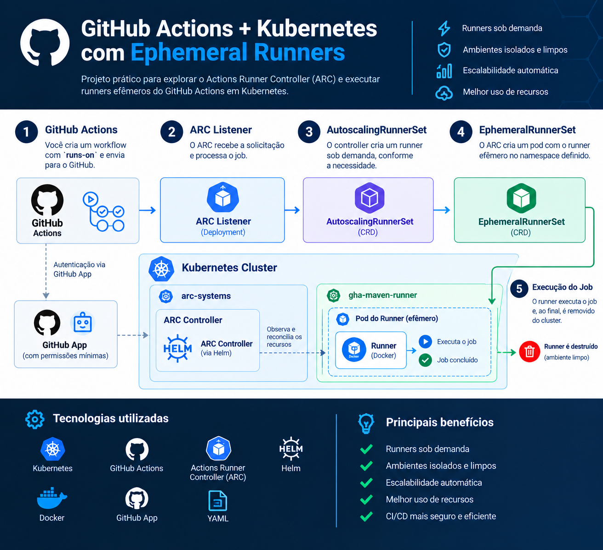
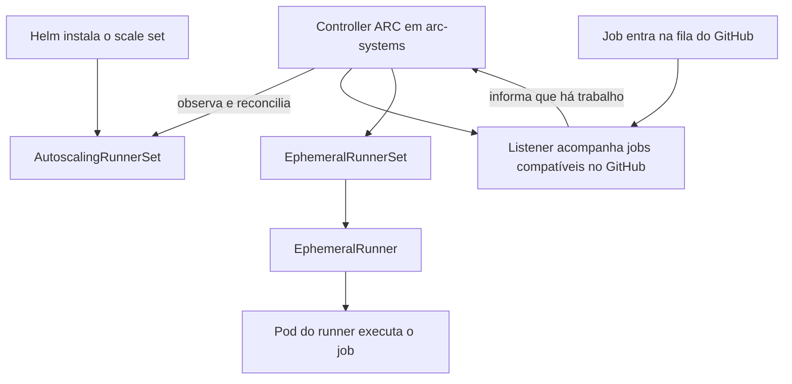

# GitHub Actions Runner Controller (ARC)



Este repositório instala um runner scale set chamado `maven-runner` para a organização `deivid-labs`. O controller e o scale set são instalações Helm separadas: o controller fica em `arc-systems`, e os pods do scale set ficam em `gha-maven-runner`.

## Visão geral

Essas configurações controlam coisas diferentes:

| Configuração | O que define | Valor neste exemplo |
| --- | --- | --- |
| Namespace do controller | Onde o processo controller roda no Kubernetes | `arc-systems` |
| Namespace do scale set | Onde ficam os recursos e pods do scale set no Kubernetes | `gha-maven-runner` |
| `githubConfigUrl` | Organização ou repositório onde o scale set é registrado no GitHub | `https://github.com/deivid-labs` |
| `runnerGroup` | Quais repositórios da organização podem usar os runners | `default` |
| `runs-on` | Nome do scale set que um job do workflow solicita | `maven-runner` |

O fluxo simplificado de um job é:



O runner group controla o acesso dos repositórios no GitHub. Já os namespaces organizam os recursos dentro do Kubernetes; um namespace não concede acesso a um repositório.

## 1. Criar um GitHub App na organização

É recomendado usar um GitHub App em vez de um Personal Access Token. Um administrador da organização, ou alguém autorizado a gerenciar GitHub Apps nela, deve:

1. Abrir **Organization settings → Developer settings → GitHub Apps → New GitHub App**.
2. Informar um nome, por exemplo `arc-runners`. A URL da página inicial pode ser a URL da organização; não é necessário configurar uma callback URL.
3. Desativar **Active** na seção de Webhook. O ARC usa o App para autenticar na API, não precisa receber webhooks.
4. Em **Permissions**, conceder somente:

   | Tipo | Permissão | Acesso |
   | --- | --- | --- |
   | Organization permissions | Self-hosted runners | Read and write |
   | Repository permissions | Actions | Read and write |
   | Repository permissions | Metadata | Read-only |

   `Metadata: Read-only` é concedida automaticamente pelo GitHub quando há permissões de repositório.
5. Em **Where can this GitHub App be installed?**, selecionar **Only on this account** e criar o App.
6. Na página do App, anotar o **App ID** e criar uma chave privada em **Private keys → Generate a private key**. Baixar o arquivo `.pem` e mantê-lo fora do repositório.
7. Abrir **Install App**, instalar o App na organização `deivid-labs` e conceder acesso aos repositórios. Para um App dedicado ao ARC, **All repositories** evita que a seleção de repositórios do App limite o acesso; o acesso dos runners aos workflows continua controlado pelo runner group.
8. Obter o **Installation ID** na URL da instalação, que tem o formato `https://github.com/organizations/deivid-labs/settings/installations/INSTALLATION_ID`.

Se permissões forem alteradas depois da instalação, aprove a atualização da instalação do App na organização.

## 2. Criar o Secret no Kubernetes

Defina os IDs e o caminho para a chave privada baixada. Não coloque o conteúdo da chave no README, nos values do Helm ou no Git.

```bash
APP_ID="<app-id>"
INSTALLATION_ID="<installation-id>"
PRIVATE_KEY_PATH="/caminho/seguro/arc-runners.pem"
RUNNER_NAMESPACE="gha-maven-runner"

chmod 600 "$PRIVATE_KEY_PATH"
kubectl create namespace "$RUNNER_NAMESPACE" --dry-run=client -o yaml | kubectl apply -f -
kubectl create secret generic arc-secrets \
  --namespace "$RUNNER_NAMESPACE" \
  --from-literal=github_app_id="$APP_ID" \
  --from-literal=github_app_installation_id="$INSTALLATION_ID" \
  --from-file=github_app_private_key="$PRIVATE_KEY_PATH" \
  --dry-run=client -o yaml | kubectl apply -f -
```

O nome `arc-secrets` precisa corresponder a `githubConfigSecret` em `templates/maven-runner.yml`. O Secret deve estar no mesmo namespace da instalação do scale set.

## 3. Instalar o controller

```bash
helm upgrade --install arc-controller \
  --namespace arc-systems \
  --create-namespace \
  oci://ghcr.io/actions/actions-runner-controller-charts/gha-runner-scale-set-controller \
  --version 0.13.1
```

## 4. Instalar o runner scale set

Execute a partir do diretório `gha-runner-scale-set`, onde está o chart local:

```bash
helm upgrade --install maven-runner \
  --values ../templates/maven-runner.yml \
  --namespace gha-maven-runner \
  --create-namespace \
  .
```

O valor `maxRunners` em `templates/maven-runner.yml` precisa ser maior que zero para que o scale set possa criar runners quando houver jobs. `minRunners: 0` permite escalar a zero quando estiver ocioso.

## Como o controller encontra o scale set

As instalações Helm do controller e do scale set não precisam estar no mesmo namespace. Ao instalar o chart local, ele cria um recurso Kubernetes `AutoscalingRunnerSet` no namespace `gha-maven-runner`. O controller ARC, mesmo rodando em `arc-systems`, observa esse tipo de recurso pela API do Kubernetes e reconcilia cada scale set encontrado.

O chart do controller configura as permissões Kubernetes necessárias para observar e gerenciar os recursos do ARC nos namespaces do cluster. Portanto, a descoberta não depende do nome do namespace, de uma referência manual entre namespaces ou de uma busca do controller no GitHub. O `githubConfigUrl` e o GitHub App servem para configurar e autenticar o scale set no GitHub; a descoberta do objeto pelo controller acontece dentro do Kubernetes.

Para conferir o recurso criado e o controller:

```bash
kubectl get autoscalingrunnersets.actions.github.com -A
kubectl get pods -n arc-systems
kubectl describe autoscalingrunnerset maven-runner -n gha-maven-runner
```

## 5. Permitir que os repositórios usem o runner

O runner é registrado no nível da organização, então é normal ele aparecer em **Organization settings → Actions → Runners** e não como um runner dedicado em cada repositório. Para autorizar os repositórios:

1. Abrir **Organization settings → Actions → Runner groups**.
2. Editar o grupo usado pelo scale set (por padrão, `default`; configure `runnerGroup` nos values se usar outro).
3. Em **Repository access**, adicionar os repositórios que podem executar jobs nesse grupo, ou escolher todos os repositórios.
4. No workflow de cada repositório autorizado, usar o nome do scale set:

```yaml
jobs:
  build:
    runs-on: maven-runner
    steps:
      - uses: actions/checkout@v4
      - run: mvn --version
```

O nome padrão do scale set é o nome da instalação Helm (`maven-runner`). Se `runnerScaleSetName` for definido em `templates/maven-runner.yml`, use esse valor em `runs-on`.

## 6. Verificar no Kubernetes

```bash
kubectl get autoscalingrunnersets -A
kubectl get pods -n gha-maven-runner
kubectl get pods -n arc-systems
```

## Deploy pelo GitHub Actions

Há dois workflows manuais, separados para permitir atualizar cada instalação de forma independente. Execute **Deploy ARC Controller** primeiro para instalar ou atualizar o controller; depois execute **Deploy Runner Scale Set** para instalar ou atualizar `maven-runner`. O segundo workflow valida que o CRD do controller e o Secret Kubernetes `arc-secrets` já existem.

O workflow **Deploy Runner Scale Set** permite escolher `max_runners` (padrão `4`, mínimo `1`); `minRunners` permanece `0` para permitir scale-to-zero.

Antes de executar, adicione o secret `KUBECONFIG` em **Settings → Secrets and variables → Actions**. O valor deve ser o conteúdo completo do kubeconfig do cluster de destino. A identidade desse kubeconfig precisa ter permissões para instalar os recursos do controller e do scale set, incluindo CRDs e recursos RBAC.

O secret Kubernetes `arc-secrets` descrito acima continua sendo pré-requisito e deve existir em `gha-maven-runner` antes do deploy do scale set. O workflow não lê nem envia a chave do GitHub App; ela permanece no Secret do Kubernetes.
